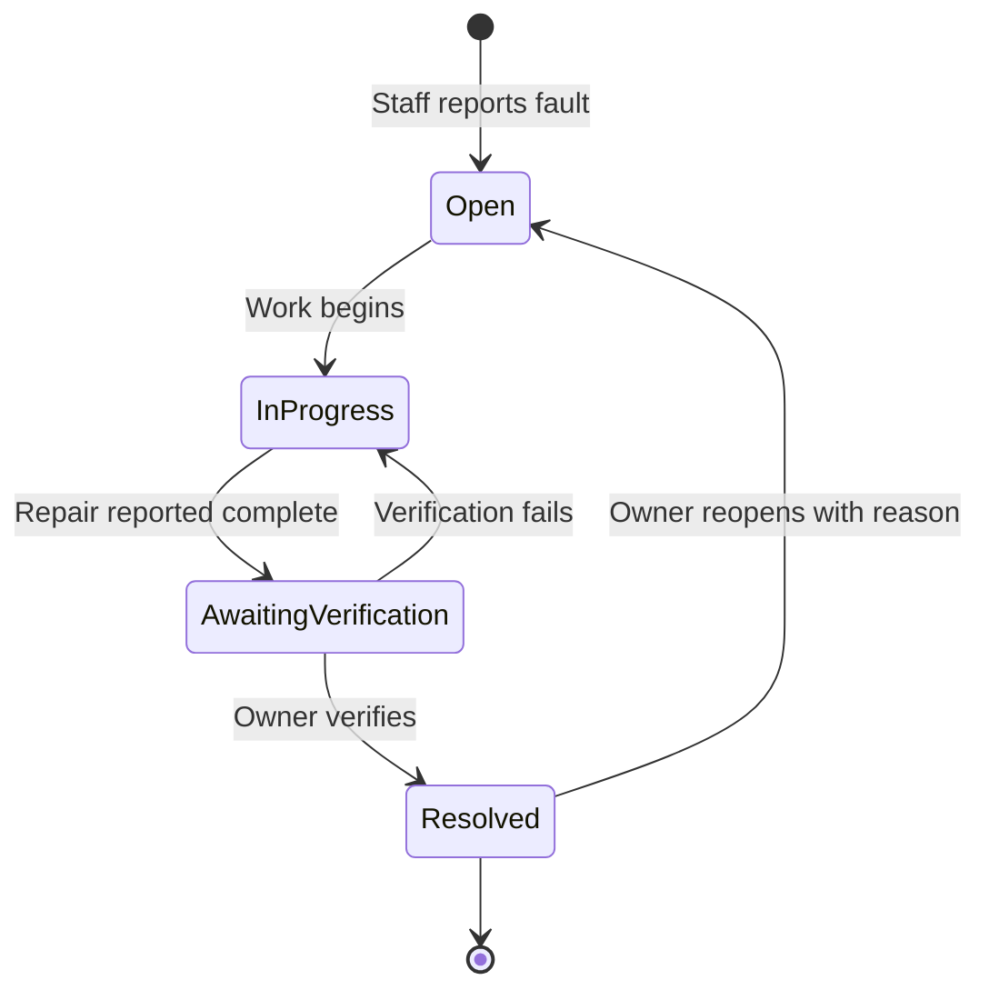
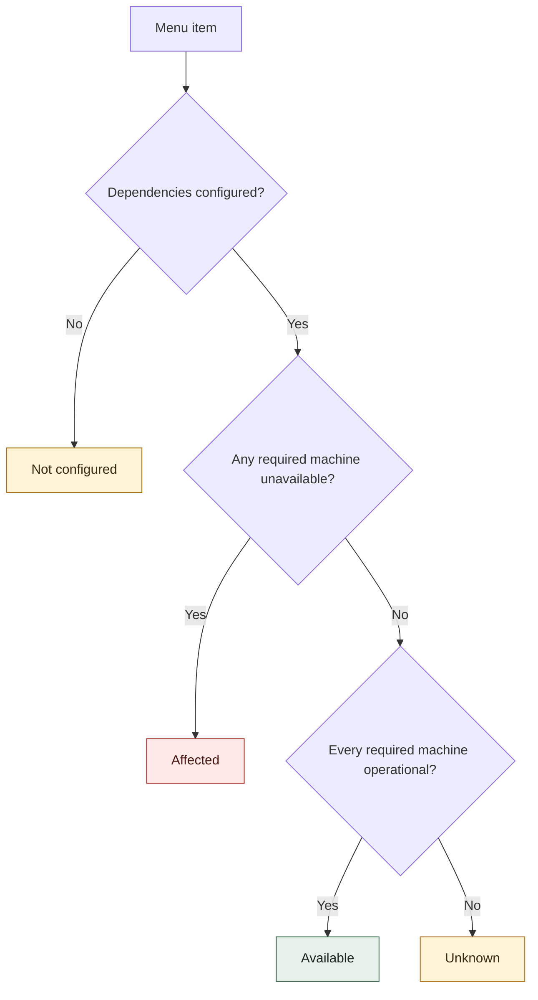
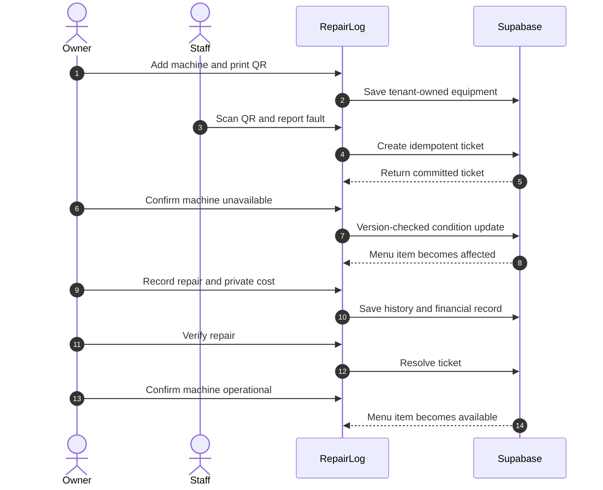
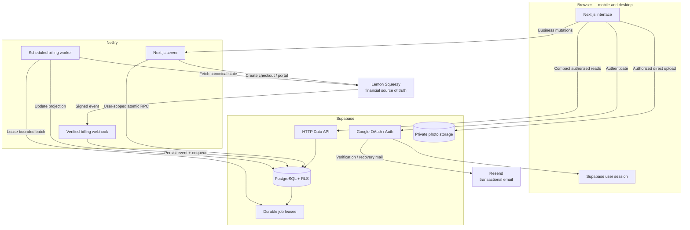
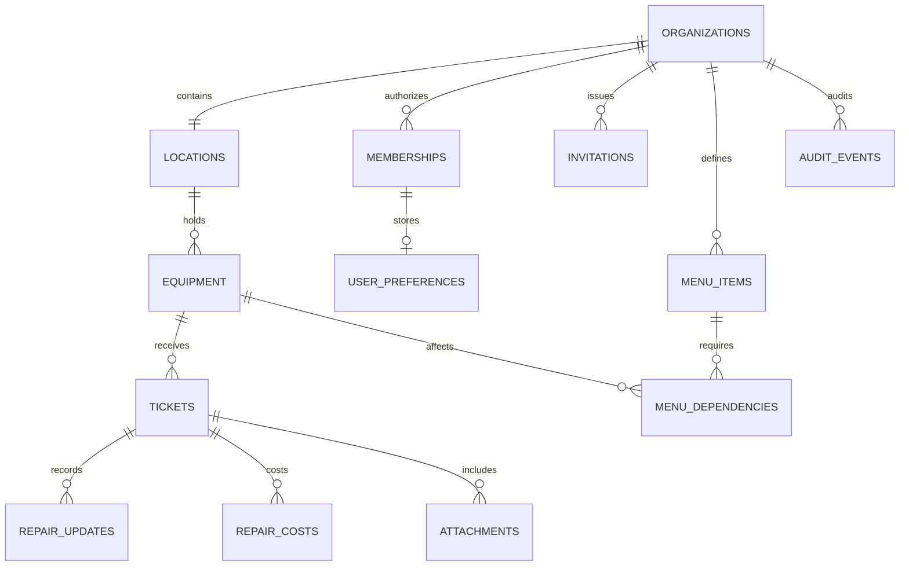
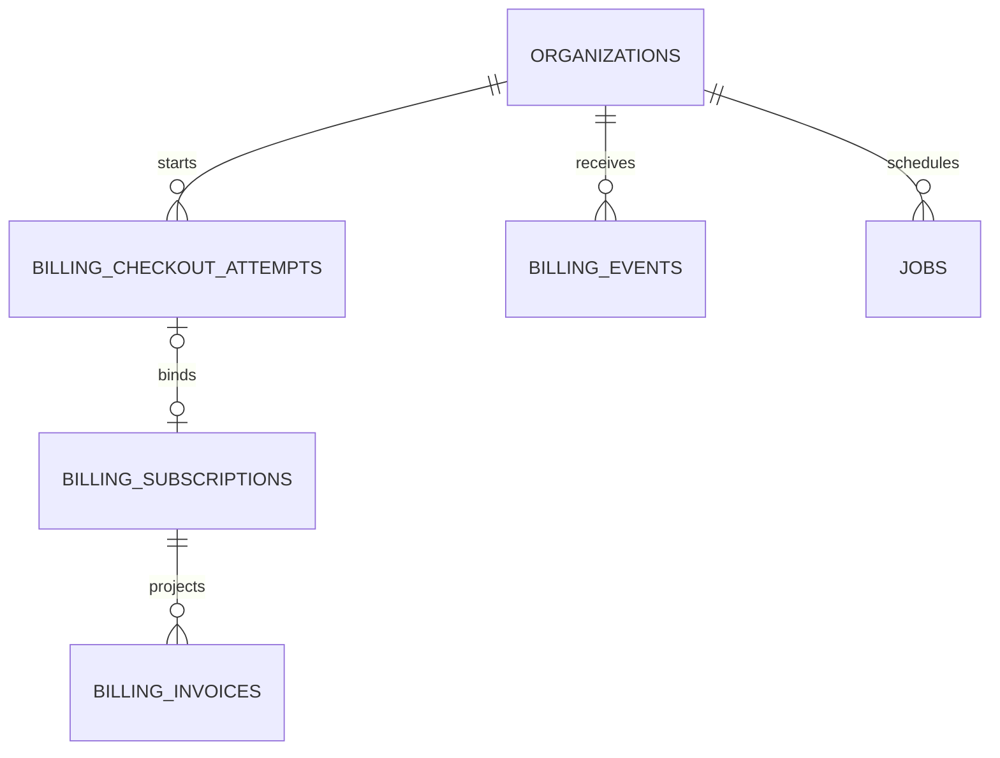
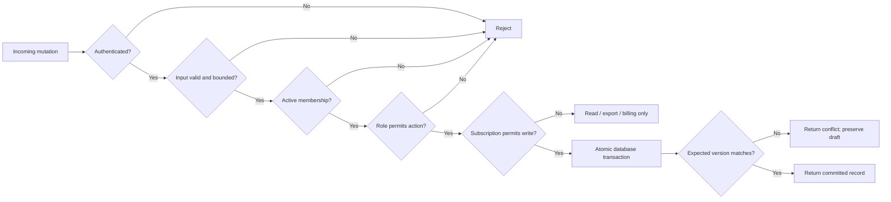
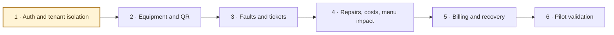

<div align="center">

# RepairLog

### From equipment fault to verified repair—without losing the history.

**A mobile-first operations system for independent cafés**

Report faults by QR code · Track repairs · Understand menu impact · Control costs

`Next.js 16` · `TypeScript` · `Supabase` · `Netlify` · `Lemon Squeezy`

> **Development status:** database foundation configured; application modules
> are being implemented. RepairLog is not yet production-ready.

</div>

---

## Contents

- [The problem](#the-problem)
- [How RepairLog works](#how-repairlog-works)
- [Owner and staff experience](#owner-and-staff-experience)
- [Workflow simulation](#workflow-simulation)
- [System architecture](#system-architecture)
- [Data architecture](#data-architecture)
- [Security model](#security-model)
- [Billing policy](#billing-policy)
- [Repository structure](#repository-structure)
- [Local development](#local-development)
- [Delivery roadmap](#delivery-roadmap)
- [Release gates](#release-gates)

---

## The problem

Small cafés often manage equipment faults through memory, chat messages, and
paper notes. That makes four questions surprisingly difficult to answer:

1. What is broken right now?
2. Which drinks or menu items are affected?
3. What repair work has already been attempted?
4. How much has the café spent fixing this equipment?

RepairLog creates one dependable operational history—from the first staff
report to the owner's final verification.

### Product at a glance

| | Launch behavior |
|---|---|
| **Customer** | Independent café with one location and a small team |
| **Pilot** | 3–5 invited cafés, approximately 20–50 users |
| **Primary action** | Scan equipment QR code and report a fault in under one minute |
| **Roles** | Owner and staff |
| **Authentication** | Google OAuth through Supabase Auth |
| **Platform** | Responsive website; no native mobile application |
| **Commercial model** | One-location subscription managed by Lemon Squeezy |
| **Default posture** | Private, tenant-isolated, least privilege |

---

## How RepairLog works

```mermaid
flowchart LR
    A["Scan equipment QR"] --> B["Describe the fault"]
    B --> C["Create one idempotent ticket"]
    C --> D["Owner confirms equipment condition"]
    D --> E["Menu impact recalculates"]
    E --> F["Record repair work and cost"]
    F --> G["Owner verifies repair"]
    G --> H["History remains searchable"]

    classDef action fill:#e8f0ea,stroke:#355f47,color:#17251d,stroke-width:1.5px;
    classDef decision fill:#fff4d6,stroke:#a66d10,color:#3b2a0d,stroke-width:1.5px;
    class A,B,C,E,F,H action;
    class D,G decision;
```



The system deliberately keeps **ticket status** and **equipment condition**
separate. A new fault does not automatically declare a machine unusable, and a
resolved ticket does not silently declare it operational. The owner confirms
both decisions.

### Ticket lifecycle



### Equipment and menu impact



An owner-approved alternative is plain-text guidance for staff. It is not
treated as proof that replacement equipment is available.

---

## Owner and staff experience

### Owner

The owner controls business configuration and verified operational truth.

- Creates the café and its launch location.
- Adds, edits, archives, and labels equipment.
- Prints equipment QR codes.
- Invites and removes staff.
- Confirms equipment condition.
- Configures menu items and equipment dependencies.
- Records technician details and repair costs.
- Verifies resolution or reopens a ticket with a reason.
- Views billing, exports, audit history, and daily expense totals.

### Staff

Staff receive a deliberately focused operational experience.

- Signs in using an invited Google account.
- Scans a QR code to open the correct equipment report.
- Reports a fault with category, priority, description, and optional photos.
- Views permitted equipment, open tickets, repair notes, and menu impact.
- Adds operational updates while work is underway.
- Cannot see costs or billing, manage roles, confirm equipment condition, or
  verify final resolution.

### Permission boundary

| Area | Owner | Staff | Enforced by |
|---|:---:|:---:|---|
| Equipment and ticket visibility | ✓ | ✓ | Membership RLS |
| Submit faults and updates | ✓ | ✓ | Authorized database functions |
| Equipment administration | ✓ | — | Owner check + database function |
| Condition confirmation | ✓ | — | Owner check + version control |
| Resolution verification | ✓ | — | Owner-only transition rule |
| Repair costs | ✓ | — | Separate financial table + RLS |
| Team management | ✓ | — | Owner-only invitation functions |
| Billing and exports | ✓ | — | Owner RLS + server authorization |

Hiding a control in the interface is never considered authorization.

---

## Workflow simulation

This example follows one incident from setup to verified recovery.

### Scene 1 — Café setup

Shuvo signs in with Google and creates **North Street Café**. He selects the
café's currency and actual IANA timezone. RepairLog atomically creates the
organization, its single launch location, and Shuvo's owner membership.

He adds an **Espresso Machine**, confirms it is operational, and prints its QR
label. He then creates a **Latte** menu item and marks the Espresso Machine as a
required dependency. Latte displays as `Available`.

### Scene 2 — Staff onboarding

Shuvo invites Maya using her work email. The invitation contains a hashed
token, intended email, expiration, and acceptance state. Maya must authenticate
with that same Google email. Wrong-email, expired, revoked, and replayed
invitations are rejected.

When accepted, Maya receives an active staff membership in North Street Café—
not access to any other RepairLog organization.

### Scene 3 — Fault report during service

The Espresso Machine starts losing pressure. Maya scans its QR code and sees a
short report form already connected to that machine. She selects **High**
priority, describes the pressure loss, and submits.

The browser supplies a unique request ID. Even if a slow connection causes a
double tap or retry, the database creates only one ticket.

The text report commits first. Maya can then upload up to two compressed JPEG,
PNG, or WebP photos to private Storage. If an upload fails, the written report
remains safe and the photo can be retried.

### Scene 4 — Operational impact

The ticket opens, but the machine's condition remains unchanged. Shuvo checks
the equipment and confirms it as `Unavailable`. Latte immediately becomes
`Affected` because one required dependency is unavailable.

The Today page now shows the open fault and affected menu item. Staff can see
that operational impact but cannot change the owner's verified condition.

### Scene 5 — Repair and cost

The ticket moves to `In progress`. Maya records an operational note. Later,
Shuvo records the technician's name, work performed, work date, and a `$125.50`
cost. The database stores that amount as `12550` minor units with `USD`; staff
cannot read the financial record.

The technician completes the work and the ticket moves to
`Awaiting verification`.

### Scene 6 — Verification and history

Shuvo tests the machine. If it fails, he returns the ticket to active work. If
it passes, he marks the ticket `Resolved` and separately confirms the machine
as `Operational`. Latte returns to `Available`.

The equipment record permanently retains the original fault, photos, repair
updates, technician details, authors, timestamps, and owner-only costs.



---

## System architecture

RepairLog is a **single Next.js modular monolith**. It has no separate API host
or permanently running worker.



### Request ownership

| Layer | Responsibility |
|---|---|
| **Browser** | Render UI, hold user session, make compact reads, compress/upload photos |
| **Next.js** | Validate identity, input, membership, role, origin, and entitlement |
| **PostgreSQL** | Enforce tenant boundaries, invariants, idempotency, and atomic writes |
| **Storage** | Keep photos private with bounded type, size, count, and signed access |
| **Scheduled worker** | Retry and reconcile billing without a permanent service |
| **Lemon Squeezy** | Own subscription status, dates, invoices, and customer billing |

---

## Data architecture

### Operational domain



### Billing and recovery domain



The database contains 18 launch tables. Financial data is intentionally stored
outside staff-readable operational records because RLS secures rows, not
arbitrary sensitive columns inside an otherwise visible row.

### Important invariants

- UUID application identifiers and UTC timestamps.
- Organization timezone controls local display and day boundaries.
- Composite tenant foreign keys prevent cross-organization relationships.
- Money uses integer minor units and explicit currency.
- One launch location per organization.
- At most two photo attachment slots per ticket.
- Equipment and ticket records use monotonically increasing versions.
- The last active organization owner cannot be removed.
- Duplicate ticket submissions share one organization, actor, and request ID.
- Billing events deduplicate by environment, store, event type, resource, and
  payload hash—not resource ID alone.

---

## Security model



### Non-negotiable controls

- Default-deny RLS on every exposed table and private Storage object.
- Browser code uses only the publishable key and authenticated session.
- Ordinary server writes retain the user's database identity.
- The elevated Supabase secret key is limited to narrow billing/recovery jobs.
- Server actions and route handlers authorize every mutation independently.
- Invitation acceptance checks intended email, expiry, replay, and revocation.
- Cookie-authenticated endpoints validate request origin.
- Private URLs, tokens, raw billing payloads, and credentials never enter logs.
- Tenant-specific and financial responses never use shared public caching.
- Logout and organization switching clear user/tenant caches.

---

## Billing policy

Lemon Squeezy remains authoritative for subscription status and financial
dates. A successful browser redirect is never proof of payment.

| Provider state | Application policy |
|---|---|
| `on_trial` | Full access until the verified provider trial boundary |
| `active` | Full access |
| `cancelled` | Access until verified `ends_at` |
| `past_due` | Existing operations continue during provider retries; owner sees payment action |
| `unpaid` / `expired` | Read, export, and billing access; new paid writes blocked |
| `paused` | Read, export, and billing access |
| Unknown / absent | Onboarding, demo, and billing only |

If the local provider projection is older than 24 hours, RepairLog restricts
new paid writes until it refreshes. It never invents a financial date or
extends access beyond a known provider boundary.

---

## Repository structure

```text
repairlog/
├── app/                       routes, layouts, and HTTP endpoints
│   ├── (marketing)/           public product pages
│   ├── (auth)/                sign-in and OAuth flows
│   ├── (dashboard)/           authenticated product screens
│   └── api/                   billing and webhook endpoints
├── components/                shared presentation components
├── database/                  ordered table-by-table Supabase SQL
├── lib/
│   ├── auth/                  sessions and identity
│   ├── permissions/           owner/staff authorization
│   ├── supabase/              browser, server, and elevated clients
│   ├── modules/               domain business logic
│   ├── providers/             Lemon Squeezy adapter
│   └── jobs/                  billing recovery handlers
├── netlify/functions/         scheduled worker entry point
├── supabase/migrations/       deployable schema history
├── tests/                     permissions, workflows, E2E, billing, load
├── scripts/                   backup and restore operations
└── docs/architecture/         architecture decisions and maps
```

Detailed boundaries are documented in
[`docs/architecture/folder-structure.md`](docs/architecture/folder-structure.md).

---

## Local development

### Prerequisites

- Node.js and npm
- Configured Supabase project
- Google OAuth provider enabled in Supabase
- Database files applied in order

### Environment

Copy `.env.example` to `.env.local`:

```dotenv
NEXT_PUBLIC_SUPABASE_URL=
NEXT_PUBLIC_SUPABASE_PUBLISHABLE_KEY=
APP_URL=http://localhost:3000
SUPABASE_PROJECT_REF=
SUPABASE_SECRET_KEY=
```

The secret key bypasses RLS. It is server-only and must never use a
`NEXT_PUBLIC_` prefix.

### Google authentication

Provider callback:

```text
https://<project-ref>.supabase.co/auth/v1/callback
```

Local Supabase Auth URL configuration:

```text
Site URL:     http://localhost:3000
Redirect URL: http://localhost:3000/**
```

Production later uses the exact HTTPS application URL and separately controlled
Netlify preview redirects.

### Start the application

```bash
npm install
npm run dev
```

Open `http://localhost:3000`.

### Quality checks

```bash
npm run lint
npm run build
```

The finished application will self-host its font or use a system font so the
production build does not rely on downloading Google Fonts.

### Database source

The [`database/`](database/) directory contains one ordered SQL source file per
table followed by authorization helpers, integrity triggers, RLS, and Storage
configuration.

For a new environment, apply the files in filename order. Do not rerun one-time
table creation files `010`–`180` after those tables exist. Never rewrite an
already-applied production migration; create a new chronological migration.

---

## Delivery roadmap



### Current status

| Area | Status |
|---|---|
| Next.js + TypeScript project | Complete |
| Module-oriented folder structure | Complete |
| 18 launch database tables | Applied |
| Authorization helpers and integrity triggers | Applied |
| RLS and private Storage definition | Applied |
| Supabase project and Google provider | Configured |
| Google sign-in, callback, session, logout | **Next** |
| Organization creation and invitations | Pending |
| Cross-tenant security tests | Pending |
| Equipment, QR, tickets, repairs, menu impact | Pending |
| Billing and scheduled reconciliation | Pending |
| Recovery and production release gates | Pending |

Detailed landing-page work begins only after authentication, tenant isolation,
and the core reporting workflow are demonstrated.

---

## Release gates

The invited pilot does not launch until applicable checks pass:

- [ ] Owner and staff workflows work on mobile and desktop.
- [ ] Business A cannot read or write Business B's records or photos.
- [ ] Staff cannot access costs, billing, roles, or repair verification.
- [ ] Direct API/RPC calls cannot bypass permissions or entitlement.
- [ ] Duplicate fault submission creates one ticket.
- [ ] Concurrent edits return a conflict instead of losing changes.
- [ ] Failed photo upload preserves the text report.
- [ ] Invalid webhook signatures are rejected.
- [ ] Duplicate and out-of-order billing events are safe.
- [ ] Checkout redirects alone never grant paid access.
- [ ] Database and private-object recovery is exercised.
- [ ] No production secrets appear in browser bundles, logs, or Git.
- [ ] No unresolved tenant leak, data-loss, or billing-integrity defect remains.

---

## Intentionally outside launch scope

AI assistants, chatbots, voice transcription, WhatsApp, external technician
accounts, multiple locations, inventory, purchase orders, POS integration,
estimated lost revenue, offline sync, push notifications, live collaboration,
advanced charts, and bulk imports.

Keeping these outside the pilot protects delivery time for tenant isolation,
correct repair history, billing integrity, recovery, and testing.

---

## Governing documents

This README summarizes the workspace's authoritative planning documents:

1. `01-RepairLog-Launch-Plan.md`
2. `02-RepairLog-System-Design.md`
3. `03-RepairLog-Providers-Costs-Credentials.md`

If implementation and documentation conflict, resolve the conflict explicitly;
never silently weaken tenant isolation, billing validation, or recovery.

<div align="center">

**RepairLog — clear faults, accountable repairs, dependable history.**

</div>
